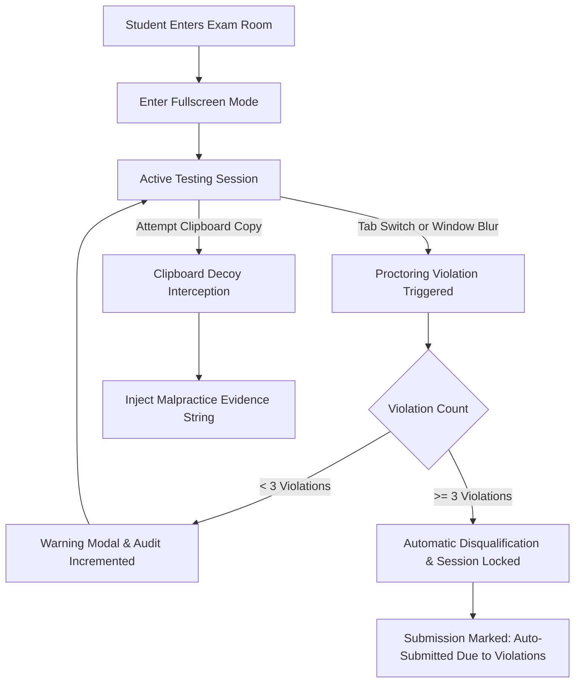
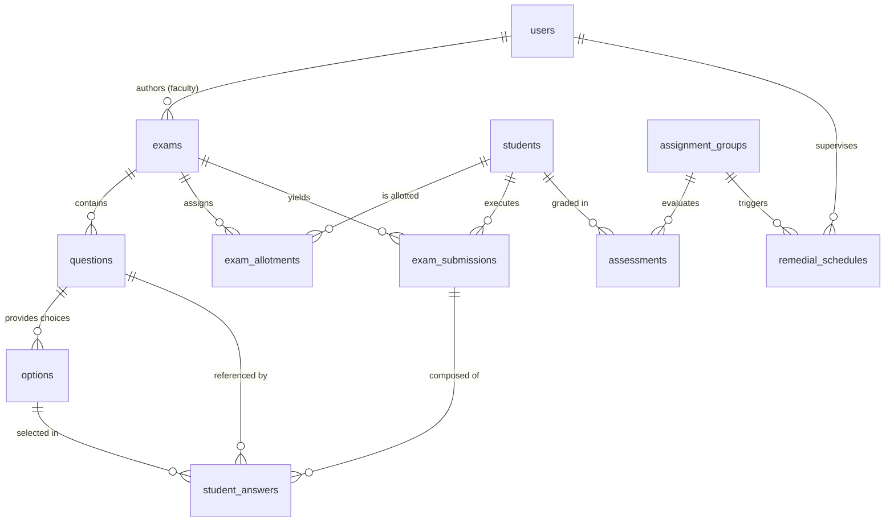

# UNNATI Examination & Assessment Management System (UNNATI-Exams)
### Official Institutional Technical Documentation & System Specification
**Cooch Behar Government Engineering College (CGEC)**  
*Affiliated to Maulana Abul Kalam Azad University of Technology (MAKAUT), West Bengal*  
*A Government of West Bengal Institution*

---

## 1. Document Control & System Identification

| Property | Specification |
| :--- | :--- |
| **System Name** | UNNATI Examination & Assessment Platform (`UNNATI-Exams`) |
| **Institution** | Cooch Behar Government Engineering College |
| **Supervising Body** | Academic Examination Cell & Department of Computer Science & Engineering |
| **Classification** | Official Institutional Educational Infrastructure |
| **Framework & Engine** | Python 3 / Flask Enterprise Web Application Framework |
| **Database Architecture** | Cloud Managed PostgreSQL (Supabase) with Local SQLite Failover |
| **Associated Ecosystem** | UNNATI Remedial Learning & Student Progression Portal |

---

## 2. System Purpose & Institutional Scope

**UNNATI-Exams** serves as the official, secure Computer-Based Testing (CBT) and continuous assessment engine for Cooch Behar Government Engineering College. Designed to uphold institutional academic integrity, the platform centralizes internal evaluations, mid-term examinations, class assessments, and diagnostic tests.

The platform is directly coupled with the institutional **UNNATI Remedial System**, enabling automatic identification of academic performance tiers (Slow Learners vs. Fast Learners), providing verifiable assessment metrics for remedial scheduling, and facilitating transparent semester progression.

---

## 3. Operational Roles & Access Matrix

Access to the UNNATI Examination portal is strictly governed by role-based authorization:

```
                                  ┌────────────────────────┐
                                  │   Institutional Root   │
                                  │   (College Admin)      │
                                  └───────────┬────────────┘
                                              │
                        ┌─────────────────────┴─────────────────────┐
                        ▼                                           ▼
             ┌─────────────────────┐                     ┌─────────────────────┐
             │   Faculty Portal    │                     │   Student Portal    │
             │   (Instructors)     │                     │   (Candidates)      │
             └─────────────────────┘                     └─────────────────────┘
```

| User Category | Identification Credential | Scope of Authority |
| :--- | :--- | :--- |
| **System Administrator** | Institutional Email | Global system configuration, semester enrollment window activation, cross-department audit, database integrity. |
| **Faculty Member** | Registered Institutional Email | Exam authoring, question paper design, negative-marking rules, diagram asset uploads, live session invocation (`allow_start`), report generation, and student performance review. |
| **Student (Candidate)** | Official College Roll Number | Account self-activation, assigned CBT room access, live exam submission, historical scorecard review, and semester progression enrollment. |

---

## 4. Key Functional Subsystems

### 4.1. Automated Examination Engine & CBT Interface
* **Candidate Question Palette:** Conforms to national computer-based testing conventions (NTA/GATE style), tracking question statuses across five standardized states:
  * `Not Visited`: Candidate has not yet navigated to the question.
  * `Not Answered`: Candidate has viewed the question without selecting an option.
  * `Answered`: Candidate has recorded a response.
  * `Marked for Review`: Candidate flagged the question for subsequent reconsideration.
  * `Answered & Marked for Review`: Candidate recorded a provisional answer with a review flag.
* **Continuous State Synchronization:** Background asynchronous AJAX transmissions (`/save_answer` and `/update_status`) preserve selections instantly, preventing data loss in the event of terminal power failure or network interruption.
* **Server-Synchronized Session Timers:** Hardened countdown timer validated against the exam's official duration (`time_limit_mins`). Expired timers trigger an involuntary submission.
* **Automated Scoring with Negative Marking:** Evaluates responses immediately upon submission, applying instructor-defined positive rewards (`marks_awarded`) and penalties (`marks_deducted`).

### 4.2. Examination Administration & Faculty Operations
* **Cohort-Targeted Test Allocation:** Exams are allocated to specific batches based on academic department and semester, restricting access exclusively to eligible students.
* **Cloudinary Media Pipeline:** Secure CDN-backed asset delivery for question figures, technical circuit diagrams, algorithm flowcharts, and mathematical formulations.
* **Controlled Test Release:** Instructors retain real-time control through the `allow_start` state toggle. Generating a system-wide access code (`EXAM-XXXXXXXX`), instructors coordinate synchronized session starts across exam halls.
* **Automated Absentee Resolution:** Concluding an exam session automatically processes all unsubmitted attempts and marks absent allotted candidates with a standardized `-1.0` institutional code.
* **Formal Markdown Paper Generation:** Instantly exports comprehensive examination papers in structured Markdown (`.md`), containing question statements, answer keys, scoring weights, and allotted candidate lists.
* **Rapid Exam Duplication:** Enables immediate cloning of complete assessment architectures (questions, choices, weights, student allotments) for repeat or remedial iterations.

### 4.3. Semester Progression & Administrative Controls
* **Enrollment Window Control:** System administrators regulate semester transition windows via the `semester_enrollment_enabled` parameter.
* **Anti-Duplication Throttle:** Students are protected by a mandatory 30-day safeguard limit (`last_sem_upgrade_date`), preventing erroneous or duplicate semester advancement.

---

## 5. Academic Integrity & Anti-Malpractice Protocols

To guarantee test validity and deter academic dishonesty, UNNATI-Exams enforces multi-layered technological countermeasures:



### 5.1. Focus & Window Surveillance
* The client session binds to document `visibilitychange` and window `blur` event listeners.
* Any unauthorized departure from the testing viewport triggers an immediate warning dialog and logs an incremented violation event on the backend.
* On the **third cumulative violation**, the examination locks automatically, finalizes the test attempt, records `tab_switches = 3`, and flags the candidate for review in faculty analytical reports.

### 5.2. Tamper-Evident Clipboard Decoy
* Copy operations (`copy` / `beforecopy`) are intercepted within the examination boundary.
* Candidate clipboards are overwritten with an institutional infraction statement:
  ```text
  "IT IS COPIED FROM THE UNNATI EXAM PORTAL, & CONSIDERED AS A MALPRACTICE"
  ```

### 5.3. Question Sequence Permutation
* Upon first entry, the system generates a pseudo-random permutation of the exam's question sequence (`question_order`), assigned specifically to that candidate's attempt.
* Candidates sitting adjacent to one another receive different question sequences, deterring unauthorized collaboration.

---

## 6. System Architecture & Database Schema

The platform is designed around a three-tier model: an interactive HTML5/Bootstrap client presentation tier, a Python Flask application logic tier, and a shared relational persistence layer.

### 6.1. Entity Relationship Model



### 6.2. Institutional Schema Definition

* **User (`users`):** Stores faculty and administrator profiles, credentials (hashed using PBKDF2:SHA256 via Werkzeug), authorization roles, and assigned subjects.
* **Student (`students`):** Official institutional student registry including Roll Number (unique identifier), current Semester, Department, encrypted credentials, and progression flags.
* **Exam (`exams`):** Examination configuration entity storing unique assignment identifiers, course titles, time boundaries, and session release flags.
* **Question & Option (`questions`, `options`):** Granular assessment units storing question descriptions, CDN figure URIs, individual scoring weights, and keyed answer options.
* **ExamAllotment (`exam_allotments`):** Relational link managing candidate eligibility per exam.
* **ExamSubmission (`exam_submissions`):** Master audit record of each examination attempt, logging total marks, completion timestamps, randomized question order, palette state JSON, and recorded tab-switch infractions.
* **StudentAnswer (`student_answers`):** Normalized record of specific option selections linked to each question within a candidate's attempt.
* **SystemSetting (`system_settings`):** Global key-value operational configuration table.

---

## 7. Institutional Infrastructure & Deployment Configuration

### 7.1. Database Engine & Connection Pooling
The application communicates with a high-availability PostgreSQL instance hosted on enterprise cloud infrastructure (Supabase AWS ap-south-1 Mumbai zone).

* **Connection Pool Strategy:**
  * Engine options configure `pool_pre_ping=True` to verify socket liveness prior to query execution.
  * Idle connection recycling is bound to 300 seconds (`pool_recycle=300`) with pool size set to 10 and max overflow capped at 15.
  * The application initialization routine automatically sanitizes connection URIs by stripping transaction-pooling flags (`?pgbouncer=true`) for native `psycopg2` compatibility.
* **Automated Schema Migration (`run_migrations`):**
  * On server initialization, the runtime inspects database catalog tables and dynamically executes non-destructive `ALTER TABLE` statements for newly deployed columns, eliminating scheduled system downtime during feature rollout.

### 7.2. Production WSGI Server Configuration
The production service is orchestrated using Gunicorn WSGI with asynchronous multithreading:

```text
web: gunicorn "app:create_app()" --workers 2 --threads 4 --worker-class gthread --timeout 120
```

* **Worker Model:** Multithreaded `gthread` configuration ensures that concurrent I/O operations from simultaneous student submissions do not starve long-polling HTTP connections.
* **Timeout Allocation:** 120-second timeout ceiling allows for batch evaluation and bulk report generation under peak load.

---

## 8. Institutional Route & Interface Index

### 8.1. Candidate Authentication & Evaluation Routes
| HTTP Method | Route Endpoint | Controller Function | Description |
| :--- | :--- | :--- | :--- |
| `GET` | `/` | `index()` | Institutional portal landing page with dual-panel authentication. |
| `POST` | `/login/student` | `login_student()` | Verifies candidate roll number and credentials. |
| `POST` | `/api/student/check-status` | `check_student_status()` | Asynchronously checks student registration status and activation state. |
| `POST` | `/student/set-password` | `set_password()` | Onboards and activates newly enrolled student accounts. |
| `GET` | `/student/dashboard` | `student_dashboard()` | Displays authorized active exams, scorecards, and registration info. |
| `GET` | `/student/exam/<id>` | `take_exam()` | Mounts proctored CBT examination environment. |
| `POST` | `/student/exam/<id>/save_answer` | `save_answer()` | Asynchronously records single question response in background. |
| `POST` | `/student/exam/<id>/update_status` | `update_status()` | Synchronizes question review flags and visited statuses. |
| `POST` | `/student/exam/<id>/submit` | `submit_exam()` | Concludes examination, audits violations, and calculates final grade. |
| `POST` | `/student/enroll_next_semester` | `enroll_next_semester()` | Executes student semester upgrade when administrative window is open. |

### 8.2. Faculty & Examination Administration Routes
| HTTP Method | Route Endpoint | Controller Function | Description |
| :--- | :--- | :--- | :--- |
| `POST` | `/login/faculty` | `login_faculty()` | Authenticates faculty members and administrators. |
| `GET` | `/faculty/dashboard` | `faculty_dashboard()` | Overview of active exams, submission counts, and shortcut actions. |
| `GET`, `POST` | `/faculty/exam/create` | `create_exam()` | Interactive authoring tool to build tests and allocate student cohorts. |
| `POST` | `/faculty/exam/<id>/start` | `start_exam()` | Toggles active status and generates official session exam code. |
| `GET` | `/faculty/exams` | `faculty_exams()` | Filterable registry of all institutional examinations. |
| `GET`, `POST` | `/faculty/exam/<id>/edit` | `edit_exam()` | Modifies questions, options, mark values, or candidate allocations. |
| `POST` | `/faculty/exam/<id>/clone` | `clone_exam()` | Creates a full duplicate of an existing test architecture. |
| `GET` | `/faculty/exam/<id>/stats` | `exam_stats()` | Detailed performance analytics, score distribution, and violation logs. |
| `GET` | `/faculty/exam/<id>/download` | `download_exam()` | Generates structured Markdown (`.md`) question paper archive. |
| `POST` | `/faculty/exam/<id>/delete` | `delete_exam()` | Permanently revokes an exam and cleans up dependent submissions. |
| `GET` | `/faculty/students` | `faculty_students()` | Department-wide student directory and academic status roster. |
| `GET` | `/faculty/student/<id>/report` | `student_report()` | Comprehensive historical assessment report for a candidate. |
| `POST` | `/admin/toggle_enrollment` | `toggle_enrollment()` | Opens or restricts the college-wide semester progression window. |
| `POST` | `/admin/upload_image` | `upload_image()` | Handles secure upload of question graphics to Cloudinary CDN. |

---

## 9. Security, Maintenance & Compliance

1. **Password Encryption & Storage:** All user and student credentials are encrypted via cryptographically secure hashes (`generate_password_hash` / `pbkdf2:sha256`). Plaintext passwords are never logged or stored.
2. **Session Security:** State is managed through secure HTTP-only cookies managed by `Flask-Login`. Distinct session prefixes (`faculty_` and `student_`) isolate privileges between academic staff and test candidates.
3. **Database Resilience:** In the event of cloud network disruption, the application maintains an automated fallback to the local offline institutional SQLite database instance (`instance/database.db`).
4. **Timezone Standardization:** All exam schedules, attempt start markers, and completion records are strictly computed in Indian Standard Time (`UTC+05:30`) via `get_ist_now()` to ensure non-repudiation during inter-department evaluations.

---

## 10. Institutional Governance & Authority

* **Supervising Authority:** Office of the Principal & Academic Council  
* **Host Institution:** Cooch Behar Government Engineering College (CGEC), Harinchawra, Cooch Behar, West Bengal 736170  
* **Official Web Portal:** [https://unnatiexams.onrender.com](https://unnatiexams.onrender.com)  
* **Platform Operations:** Department of Computer Science & Engineering (UNNATI Initiative)  
